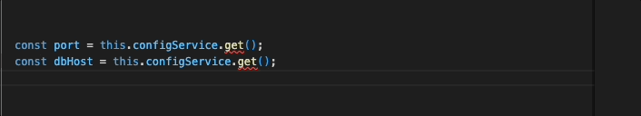

# Typed ConfigService in NestJS



## Feature

- Strongly Typed argument(property path) for Nested Configuration Object
  

- Dynamic return type according to config variables

  
  

## Code
- config/configuration.ts
  ``` ts
  export interface EnvironmentVariables {
      port: number;
      database: {
          host: string;
          port: number;
      }
  }

  export default (): EnvironmentVariables => ({
      port: parseInt(process.env.PORT, 10) || 3000,
      database: {
        host: process.env.DATABASE_HOST || 'localhost',
        port: parseInt(process.env.DATABASE_PORT, 10) || 5432
      }
  });
  ```

- config/typed-config.service.ts
  ``` ts
  type Leaves<T> = T extends object
    ? {
        [K in keyof T]: `${Exclude<K, symbol>}${Leaves<T[K]> extends never
          ? ''
          : `.${Leaves<T[K]>}`}`;
      }[keyof T]
    : never;

  type LeafTypes<T, S extends string> = S extends `${infer T1}.${infer T2}`
    ? T1 extends keyof T
      ? LeafTypes<T[T1], T2>
      : never
    : S extends keyof T
    ? T[S]
    : never;

  type Paths<T> = T extends object ? { [K in keyof T]:
      `${Exclude<K, symbol>}${"" | `.${Paths<T[K]>}`}`
  }[keyof T] : never

  type PathTypes<T, S extends string> = S extends `${infer T1}.${infer T2}`
    ? T1 extends keyof T
      ? PathTypes<T[T1], T2>
      : never
    : S extends keyof T
    ? T[S]
    : never

  @Injectable()
  export class TypedConfigService {
    constructor(private configService: ConfigService) {}

    // Get values of leaves
    get<T extends Leaves<EnvironmentVariables>>(propertyPath: T): LeafTypes<EnvironmentVariables, T> {
      return this.configService.get(propertyPath);
    }

    // Get values of all paths
    getObject<T extends Paths<EnvironmentVariables>>(propertyPath: T): PathTypes<EnvironmentVariables, T> {
      return this.configService.get(propertyPath);
    }
  }
  ```

- config/typed-config.module.ts
  ``` ts
  @Module({
      imports: [
        ConfigModule.forRoot({
          load: [configuration],
        }),
      ],
      providers: [TypedConfigService],
      exports: [TypedConfigService],
    })
    export class TypedConfigModule {}
  ```